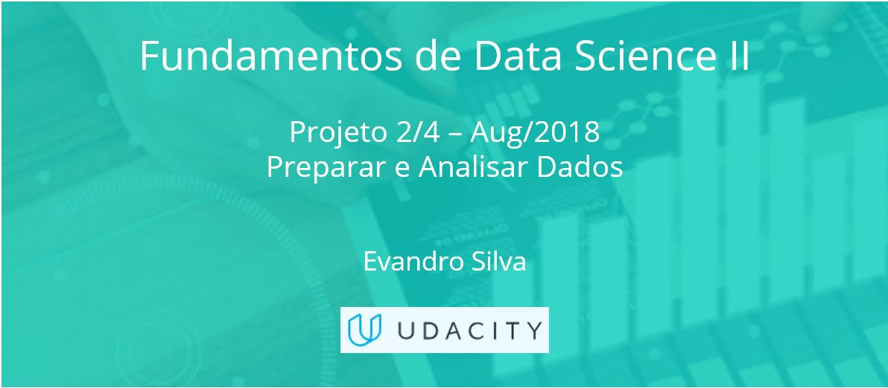

### Nanodegree - Fundamentos de Data Science II - Projeto 2 de 4 (UDACITY)

#### Projeto/Necessidade de negócio: 
- Def_Proj - Preparar e Analisar Dados.pdf

#### Entrega: 
- Act Report.pdf
- Wrangle Report.pdf
- twitter_archive_master.csv
- wrangle_act.ipynb

#### Avaliação do cliente:
 - Udacity Reviews.pdf
